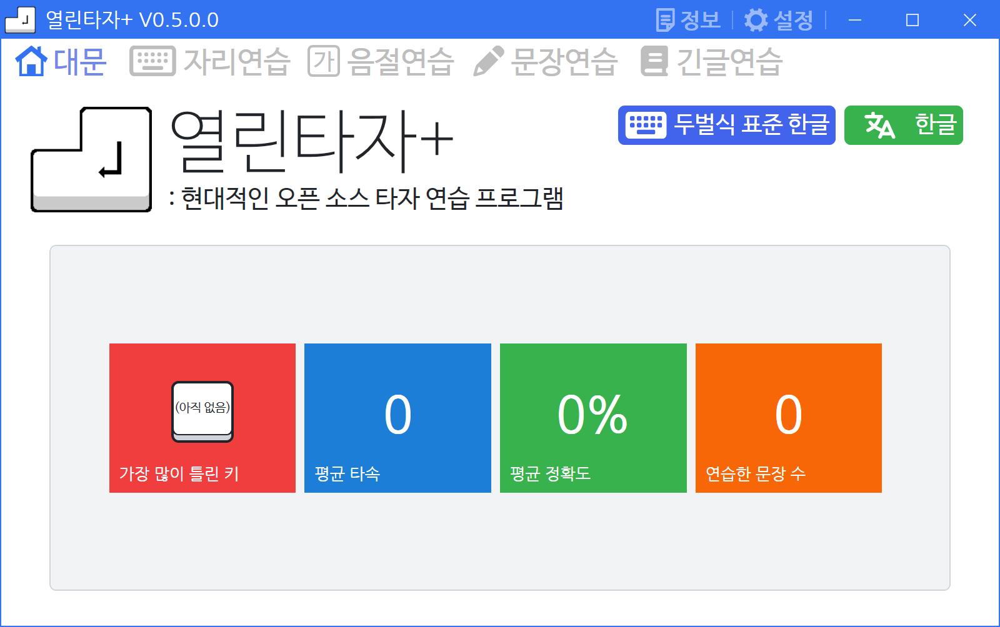
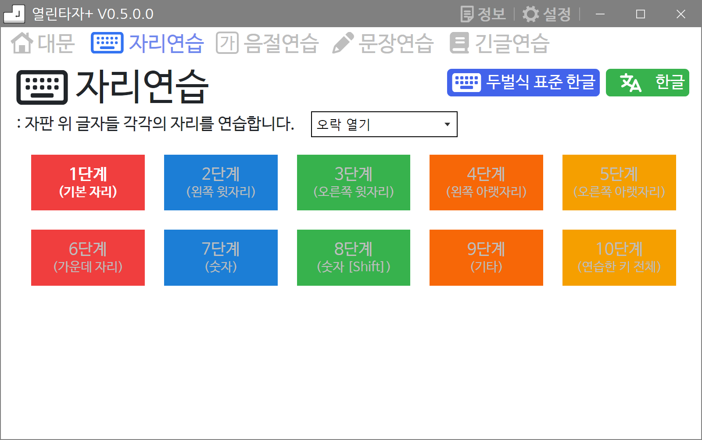
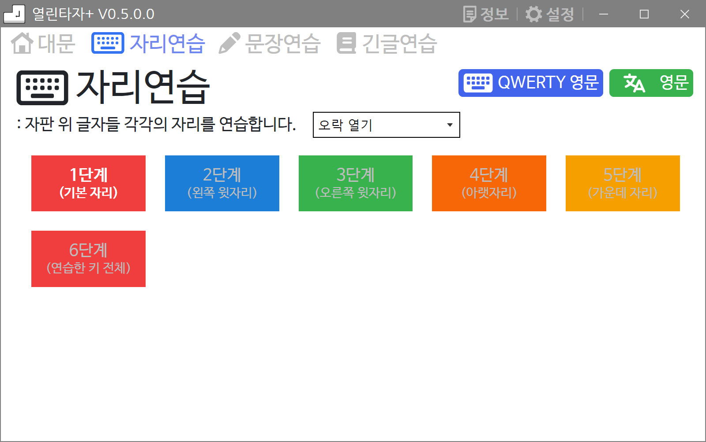
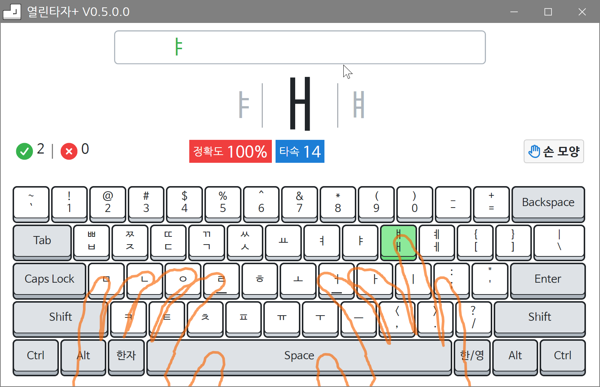
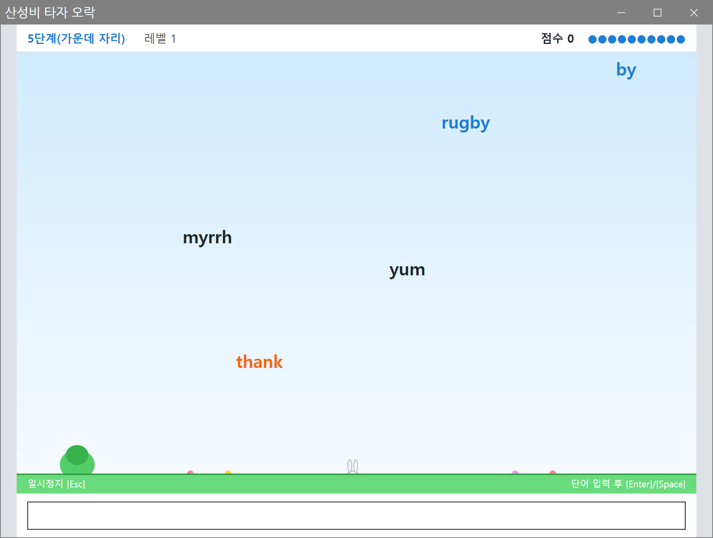
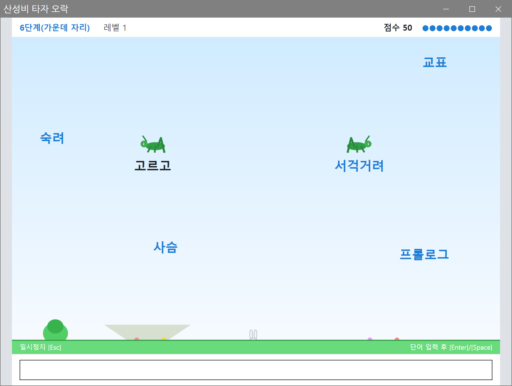
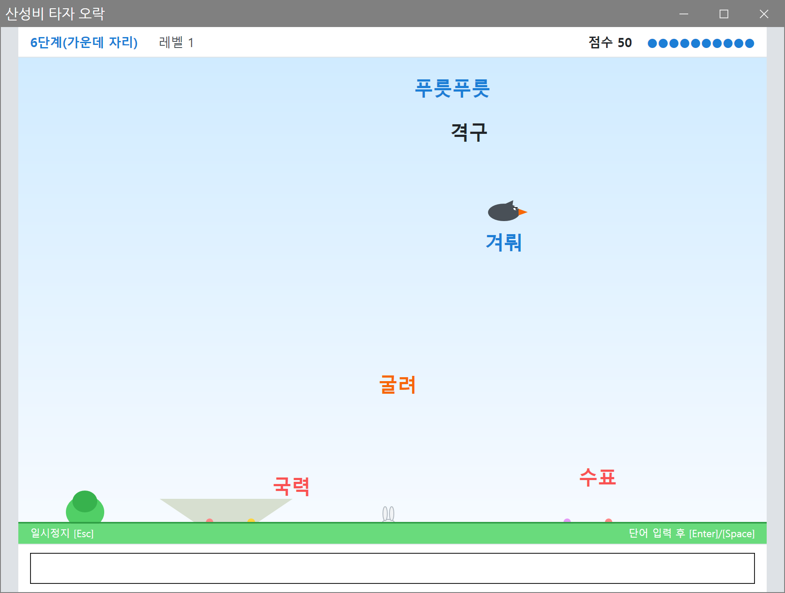
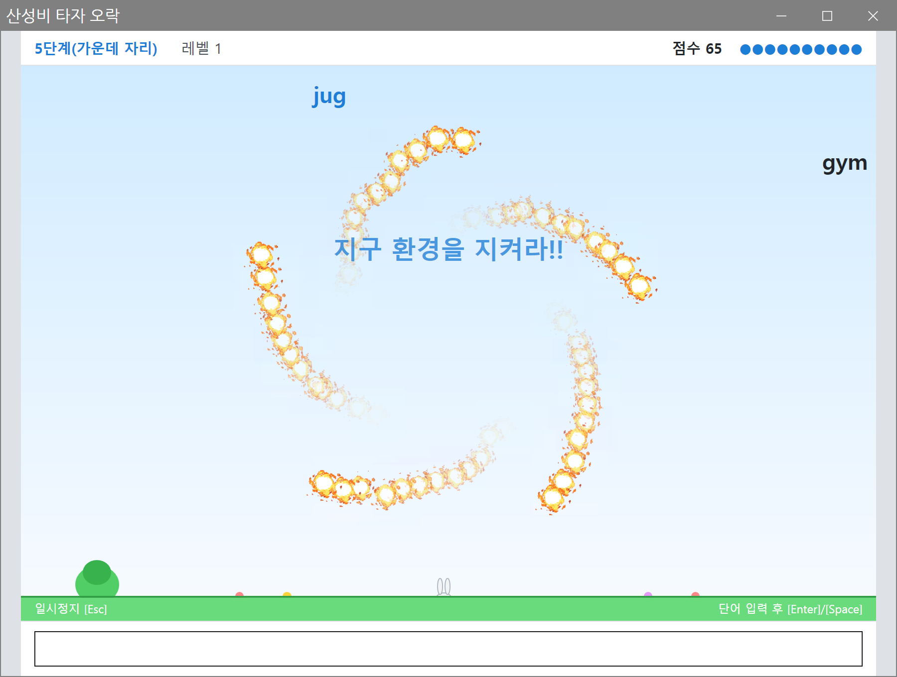
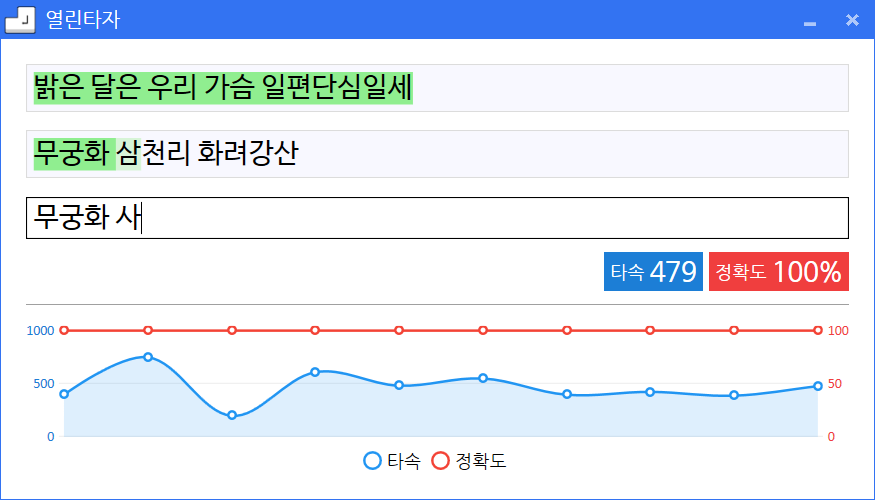
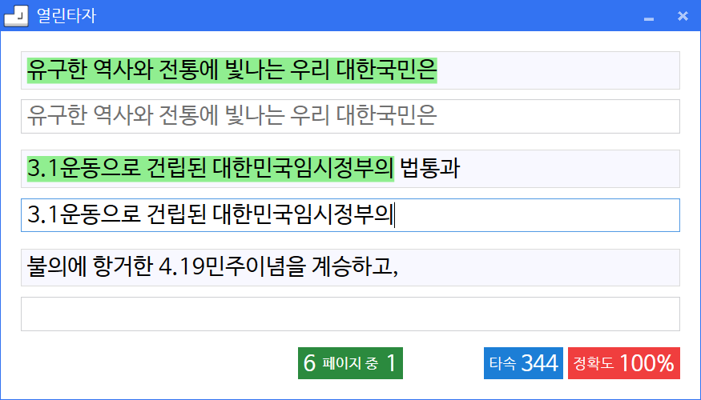

# 열린타자+(Open Typing Plus)

열린타자+는 현대적인 오픈 소스 타자 연습 프로그램입니다. 다양한 자판 종류(두벌식 표준 한글, QWERTY 영문, 세벌식 390 한글, Dvorak 영문 등, 사용자가 추가할 수 있음) 지원, 보기 좋은 디자인, 쓰기 쉬운 인터페이스의 제공이 목표입니다.

현재까지 구현된 연습의 종류는 자리 연습, 음절 연습(한글 자판 한정), 문장 연습, 긴 글 연습이 있으며, 두벌식 표준 한글 자판과 QWERTY 영문 자판에서는 단계별 자리연습과 산성비 타자 오락을 제공합니다. 자리 연습 단계를 목표 타수 이상으로 통과하면 해당 단계의 "산성비 타자 오락"이 열리고 다음 단계가 이어서 열립니다.

개발자를 위한 '손 모델 3D(Hand Model 3D: 타자하는 손 모양 그림을 생성)'과 '키보드 키 테스트(Keyboard Key Test: 키보드의 크기/깊이/색 등을 변경해보는 테스트)'를 별도로 제작하여 GitHub에 올렸습니다.

- 손 모델 3D(Hand Model 3D): https://github.com/CHBte/HandModel3D

- 키보드 키 테스트(Keyboard Key Test): https://github.com/CHBte/KKeyTest

## 사진

### 대문 화면

### 자리연습 (한글)

두벌식 표준 한글 기준으로 단계별 타일이 나뉘어 있고, 목표 타수를 통과해야 다음 단계와 오락이 열립니다.

### 자리연습 (영문)

QWERTY 영문 자판에서도 오락이 제공됩니다.

### 자리연습 새 창

단계 타일을 클릭하면 열리는 창입니다. 렌더링 키보드 위에 손가락 레이어가 겹쳐지고, 제시된 키를 맞게 누르면 노란색으로, 틀리게 누르면 빨간색으로 표시됩니다.

### 산성비 타자 오락

자리연습 단계를 통과하면 열리는 오락입니다. 떨어지는 단어를 입력해 지우면 점수를 얻습니다.

### 오락 특수 효과

특정 조건을 만족하면 화면에 재미있는 효과가 나타납니다.

### 문장연습 결과

한 문장씩 나누어 연습하며, 완료 후 타속·정확도 변화를 그래프로 볼 수 있습니다.

### 긴글연습

하나의 장문을 여러 줄로 나누어 이어서 연습합니다.

## 기여

이 프로그램은 원작자(Gear)의 소스를 포크(fork)하여 제작하였습니다.
